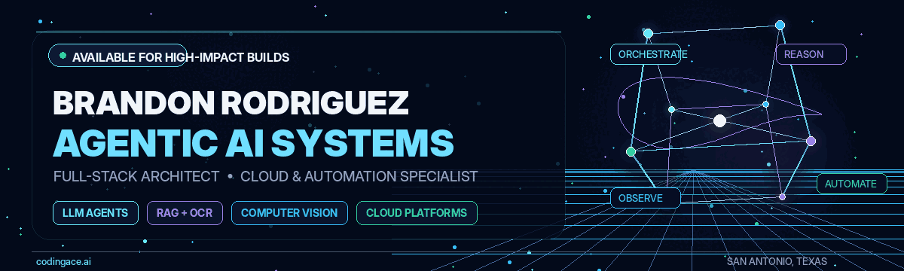
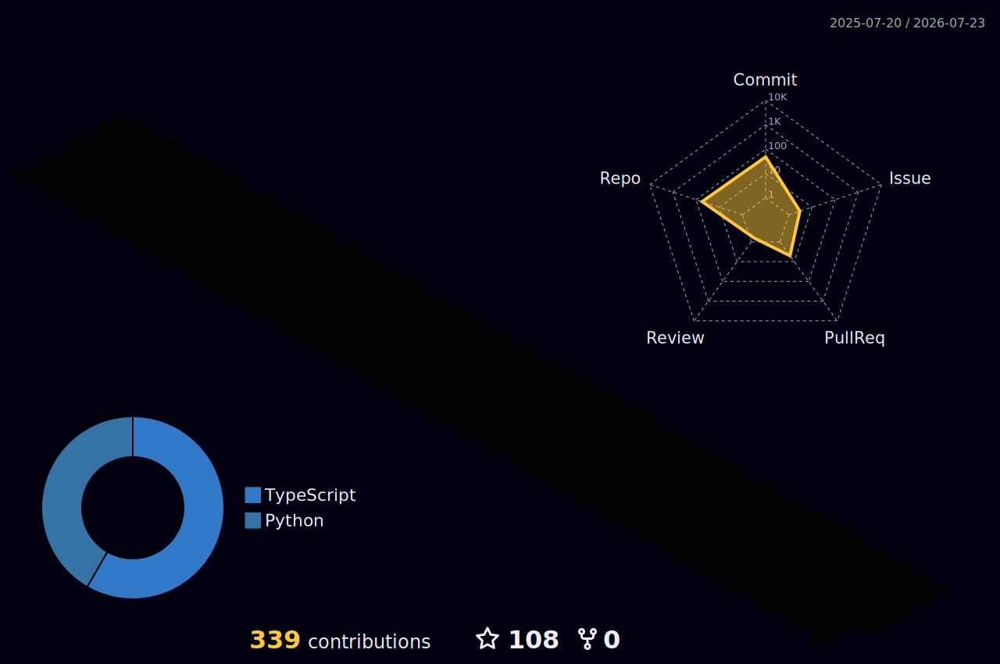

<!--
  GitHub profile README for ProChampion841.
  Keep the headings and project descriptions text-based so search engines,
  GitHub search, recruiters, and screen readers can understand the profile.
-->

  <picture>
    <source media="(prefers-reduced-motion: reduce)" srcset="./assets/brandon-3d-banner.png" />
    
  </picture>

<h1 align="center">Brandon Rodriguez</h1>
<h3 align="center">AI Agentic Systems Engineer · Full-Stack Architect · Cloud &amp; Automation Specialist</h3>

  

  
  
  
  

  <strong>I design and ship production-grade AI products that create measurable business value.</strong> 
  My work spans agentic AI, LLM application engineering, retrieval-augmented generation, OCR and document intelligence,
  computer vision, full-stack platforms, cloud architecture, workflow automation, and operational analytics.

  <code>San Antonio, Texas</code> · <code>Available for consulting, architecture, and high-impact product builds</code>

---

## AI Systems I Build

<table>
  <tr>
    <td width="50%" valign="top">
      <h3>🤖 Agentic AI &amp; LLM Systems</h3>
      Tool-using language-model agents that coordinate APIs, databases, search, business rules, and human approvals. I focus on structured outputs, evaluation, observability, guardrails, and reliable fallbacks—not demos that fail silently.
    </td>
    <td width="50%" valign="top">
      <h3>📄 RAG &amp; Document Intelligence</h3>
      OCR, retrieval-augmented generation, entity extraction, classification, validation, and review workflows for financial, legal, operational, and knowledge-management use cases.
    </td>
  </tr>
  <tr>
    <td width="50%" valign="top">
      <h3>🧠 Computer Vision &amp; ML Platforms</h3>
      PyTorch and YOLO pipelines, real-time inference applications, ONNX deployment, telemetry, measurement tooling, model evaluation, and practical MLOps for desktop, edge, and cloud environments.
    </td>
    <td width="50%" valign="top">
      <h3>☁️ Full-Stack &amp; Cloud Architecture</h3>
      React and Next.js interfaces, Python and Node.js services, PostgreSQL and Redis data layers, containerized delivery, infrastructure as code, CI/CD, and production monitoring on modern cloud stacks.
    </td>
  </tr>
</table>

---

## Selected Delivery Outcomes

| Business outcome | Measured impact |
| --- | ---: |
| LLM agent for support triage | **96% intent-match accuracy** |
| OCR-driven document workflow | **60% faster processing** |
| Automated validation pipelines | **90% fewer operational errors** |
| Executive and operations dashboards | **Real-time decision visibility** |

---

## Featured Engineering Work

| Project | What it demonstrates | Core stack |
| --- | --- | --- |
| **[TeamDoc — Real-Time Collaborative Docs](https://github.com/ProChampion841/Offline_Team_Docs)** | Collaborative document editing with CRDT synchronization, WebSocket persistence, JWT authentication, sharing rules, presence, and team workflows. | Django, Channels, Next.js, Tailwind CSS, Yjs |
| **[YOLO Inference Studio](https://github.com/ProChampion841/Yolo-Inference-App)** | A desktop computer-vision application with webcam and RTSP inference, PTZ camera control, SAHI slicing, history replay, annotation, CSV export, and performance analytics. | Python, PyQt5, Ultralytics YOLO, OpenCV, pandas |
| **[MASF-YOLO for Aerial Small-Object Detection](https://github.com/ProChampion841/MASF-YOLO-An-Improved-YOLOv11-Network-for-Small-Object-Detection-on-Drone-View)** | An unofficial PyTorch implementation of a YOLO11 architecture designed for tiny, densely packed objects in drone imagery, including custom feature aggregation and attention modules. | PyTorch, Ultralytics, OpenCV, Python |
| **[SAC GRU Distributed Training &amp; Visualization](https://github.com/ProChampion841/SAC-RL-Train-VisualizeTools-PC-Web-)** | Soft Actor-Critic training for Simulink DLL environments with MLP and GRU policies, ONNX export, inference tooling, and desktop/web telemetry dashboards. | PyTorch, ONNX, PyQt5, Dash, Plotly |

  <a href="https://github.com/ProChampion841?tab=repositories"><strong>Explore all repositories →</strong></a>
  &nbsp;·&nbsp;
  <a href="https://codingace.ai/portfolio"><strong>View client and product case studies →</strong></a>

---

## Technical Stack

### AI, Machine Learning &amp; Computer Vision

  
  
  
  
  
  

### Languages, Backend &amp; APIs

  
  
  
  
  
  
  

### Frontend &amp; Product Interfaces

  
  
  
  

### Data, Cloud &amp; DevOps

  
  
  
  
  
  
  
  

---

## GitHub Activity

  
  

### 3D Contribution Map

  

### Contribution Stream

  <picture>
    <source media="(prefers-color-scheme: dark)" srcset="https://raw.githubusercontent.com/ProChampion841/ProChampion841/output/github-contribution-grid-snake-dark.svg" />
    <source media="(prefers-color-scheme: light)" srcset="https://raw.githubusercontent.com/ProChampion841/ProChampion841/output/github-contribution-grid-snake.svg" />
    
  </picture>

---

  
<strong>🧭 Engineering Principles</strong>

   

- Ship small, instrument early, and iterate from real usage.
- Use feature flags, staged rollouts, and reversible changes for AI features.
- Treat evaluation, traces, latency, cost, and failure modes as product requirements.
- Prefer explicit schemas, deterministic validation, and human approval for high-impact actions.
- An AI system that cannot explain or trace its decisions should not make irreversible production changes.

---

## Let’s Build Something Valuable

  Building an AI product, LLM agent, RAG platform, document-intelligence workflow, computer-vision system,
  cloud-native application, or operations automation program?

  <a href="mailto:brandon@codingace.ai"><strong>brandon@codingace.ai</strong></a>
  &nbsp;·&nbsp;
  <a href="https://linkedin.com/in/brandon-rodriguez-champion/"><strong>LinkedIn</strong></a>
  &nbsp;·&nbsp;
  <a href="https://codingace.ai/portfolio"><strong>Portfolio</strong></a>

